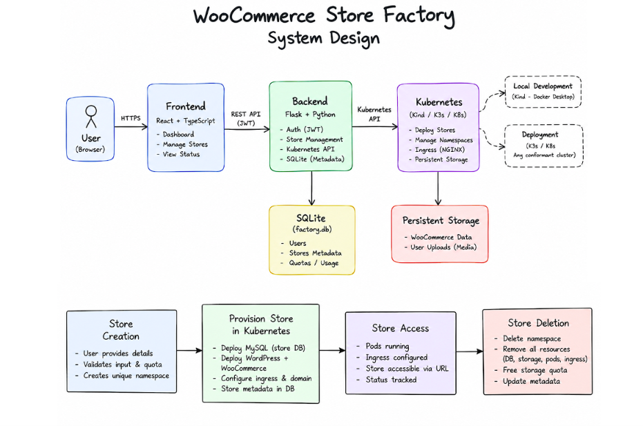

# WooCommerce Store Factory

A local-first cloud-native platform that lets a user launch and delete isolated WooCommerce stores through a React dashboard. Each store runs in its own Kubernetes namespace with its own MySQL database, its own admin password, and the products the user entered.



## Architecture

React/Vite dashboard → REST API → FastAPI + JWT → SQLite (factory metadata) → Kubernetes Python client → Kubernetes (Kind locally).

Each store namespace contains a MySQL StatefulSet with persistent storage, a WordPress Deployment with its own PVC, Services, a Secret and ConfigMap, an optional Ingress, and a WP-CLI Job that installs WordPress and WooCommerce.

Rules the code follows:

1. FastAPI, JWT authentication, SQLite only for factory metadata.
2. The official Kubernetes Python client does all provisioning. No `kubectl` subprocesses.
3. Namespace-per-store is the lifecycle and isolation boundary.
4. WooCommerce is a WordPress plugin, not a separate pod.
5. Readiness is read from Kubernetes status. Nothing waits on a fixed sleep.
6. Every create call tolerates "already exists", so provisioning can be re-run safely.
7. Portable to any standard Kubernetes cluster. K3s is not a dependency.
## Project Structure

```text
woocommerce-store-factory/
├── backend/                         # FastAPI backend
│   ├── app/
│   │   ├── api/
│   │   │   ├── auth.py              # Authentication endpoints
│   │   │   └── stores.py            # Store management endpoints
│   │   ├── k8s/
│   │   │   ├── client.py             # Kubernetes API client
│   │   │   ├── cluster.py            # Cluster operations
│   │   │   ├── manifests.py          # Kubernetes resource manifests
│   │   │   └── wait.py               # Resource readiness checks
│   │   ├── services/
│   │   │   ├── executor.py           # Background store operations
│   │   │   └── provisioner.py        # Store provisioning/deletion
│   │   ├── config.py                 # Application configuration
│   │   ├── database.py               # SQLite database setup
│   │   ├── deps.py                   # API dependencies
│   │   ├── models.py                 # Database models
│   │   ├── naming.py                 # Store/namespace naming
│   │   ├── schemas.py                # API schemas
│   │   ├── security.py               # Authentication/security
│   │   └── main.py                   # FastAPI entry point
│   ├── tests/                         # Backend and Kubernetes tests
│   ├── Dockerfile                     # Backend container
│   ├── requirements.txt               # Production dependencies
│   ├── requirements-dev.txt           # Development dependencies
│   ├── pytest.ini                     # Pytest configuration
│   └── .env.example                   # Environment configuration template
│
├── frontend/                          # React + TypeScript dashboard
│   ├── src/
│   │   ├── components/                # Dashboard UI components
│   │   ├── api.ts                     # Backend API client
│   │   ├── hooks.ts                   # React hooks
│   │   ├── types.ts                   # TypeScript types
│   │   ├── App.tsx                    # Main application
│   │   ├── App.test.tsx               # Frontend tests
│   │   ├── main.tsx                   # Frontend entry point
│   │   └── styles.css                 # Application styles
│   ├── Dockerfile                     # Frontend container
│   ├── nginx.conf                     # Nginx configuration
│   ├── package.json                   # Frontend dependencies
│   ├── package-lock.json
│   ├── tsconfig.json
│   ├── vite.config.ts
│   └── index.html
│
├── helm/
│   └── store-factory/                 # Helm chart
│       ├── templates/
│       │   ├── _helpers.tpl
│       │   ├── backend.yaml           # Backend deployment
│       │   ├── frontend.yaml          # Frontend deployment
│       │   └── rbac.yaml              # Kubernetes RBAC
│       ├── Chart.yaml
│       └── values.yaml
│
├── deploy/
│   ├── k8s/
│   │   └── values.yaml                # Standard Kubernetes configuration
│   ├── k3s/
│   │   └── values.yaml                # K3s configuration
│   ├── kind-config.yaml               # Local Kind cluster
│   └── README.md                      # Deployment instructions
│
├── docs/
│   └── SYSTEM_DESIGN.md               # System architecture documentation
│
├── .github/
│   └── workflows/
│       └── ci.yml                     # CI workflow
│
├── .gitignore
└── README.md


```
## Store lifecycle
requested → provisioning → initializing → ready
                 ↓              ↓
               failed  ←────────┘        (retry → requested)

any state → deleting → deleted
```

## Launching a store

The Launch store dialog collects:

- **Store name**, which becomes the address and the namespace.
- **Admin password**, generated by default with regenerate and copy buttons, or typed. It becomes the real WordPress admin password.
- **WordPress storage in Gi**, which becomes the WordPress PVC size.
- **Initial products** (name, price, description), which are created as real WooCommerce products.

The password travels: dashboard → API → an encrypted, temporary database column → Kubernetes Secret → WP-CLI → WordPress admin user. The column is cleared as soon as the Secret exists. It is never returned by the list API or written to logs. The owner can read it back from the store card, which calls the owner-only `/credentials` endpoint.

Limits, enforced by the backend:

- 3 stores per user (`MAX_STORES_PER_USER`).
- 5 Gi of WordPress storage per user in total (`MAX_STORAGE_GI_PER_USER`), at most 5 Gi per store. MySQL adds a fixed 1 Gi per store on top, which does not count toward the quota.
- Deleted stores free their quota. The dashboard shows `used / limit` for both, read from `GET /api/stores/usage`.

Each store namespace also gets a ResourceQuota that caps requested storage at the store's allocation, and a LimitRange with per-volume bounds and default container limits.

## Demo checkout

Every store is set up so this works with no manual steps:

Products → Add to cart → Cart → Checkout → billing details → Cash on delivery → Place order → the order appears in WordPress Admin → WooCommerce → Orders.

Setup applied by the init Job: Cart and Checkout use the classic shortcode pages, guest checkout is on, shipping is off (so no shipping zone is needed), Cash on delivery is enabled, and the shop page is the home page. Currency defaults to INR (`STORE_CURRENCY`, `STORE_COUNTRY`).

Use any made-up billing address, for example: Demo Customer, 1 Demo Street, Bengaluru, Karnataka 560001, any phone number and email.

## Razorpay test payments

Optional, and test mode only. Set both keys in `backend/.env`:

```
RAZORPAY_KEY_ID=rzp_test_xxxxxxxx
RAZORPAY_KEY_SECRET=xxxxxxxx
```

Keys that do not start with `rzp_test_` stop the backend from starting. When both are set, each new store gets them in its own Kubernetes Secret, and the init Job installs and configures the official Razorpay plugin (`woocommerce-razorpay`), enables it next to Cash on delivery, and sets the currency to INR. The keys are never written into the repository, the ConfigMap or the Job script.

If a key is missing, or the plugin cannot be installed, the Job carries on and the store still has Cash on delivery. `kubectl logs -n store-<name> job/wordpress-init` shows which step was skipped.

To pay: choose the Razorpay option at checkout and use Razorpay's test details. UPI: `success@razorpay` succeeds and `failure@razorpay` fails. Test cards are listed in Razorpay's documentation. Which methods (including UPI) appear in the Razorpay window is controlled by your Razorpay test dashboard settings, so enable UPI there. The browser needs internet access to load Razorpay's checkout. Orders are marked paid from the browser callback. Razorpay webhooks need a public URL, so they are not set up for localhost.

Manual setup if the plugin was not configured automatically: WordPress Admin → Plugins → Add New → "Razorpay for WooCommerce" → Install and Activate → WooCommerce → Settings → Payments → Razorpay → enable, paste the test Key ID and Key Secret, Save. Make sure the store currency is INR under WooCommerce → Settings → General.

Provisioning order: namespace and quota → Secrets and ConfigMap → MySQL Service and StatefulSet → wait for MySQL → WordPress PVC, Deployment, Service, Ingress → wait for WordPress → WP-CLI Job → `ready`.

Deletion removes the namespace, waits until it is gone, then marks the row `deleted`. A store name can be reused afterwards.

Interrupted work resumes on backend start: stores left in `requested`, `provisioning`, `initializing` or `deleting` are picked up again.

## Run locally

Prerequisites: Python 3.12, Node 20+, Docker Desktop, `kubectl`, Kind.

Cluster with ingress on host ports 80 and 443:

```powershell
kind create cluster --name woocommerce-factory --config deploy/kind-config.yaml
kubectl apply -f https://kind.sigs.k8s.io/examples/ingress/deploy-ingress-nginx.yaml
kubectl wait --namespace ingress-nginx --for=condition=ready pod --selector=app.kubernetes.io/component=controller --timeout=120s
```

Backend:

```powershell
cd backend
python -m venv venv
.\venv\Scripts\Activate.ps1
pip install -r requirements.txt
copy .env.example .env
uvicorn app.main:app --reload
```

Frontend:

```powershell
cd frontend
npm install
npm run dev
```

Open http://localhost:5173, create an account (username, email, password), sign in, and choose New store. Stores are served at `http://<name>.localhost`. If port 80 is taken on your machine, map another host port in `deploy/kind-config.yaml` and set `STORE_PUBLIC_PORT` to match.

First milestone check: launch a store named `demo`, then check it:

```powershell
kubectl get ns store-demo
kubectl get sts,deploy,pvc,svc,ingress,job -n store-demo
kubectl get resourcequota,limitrange -n store-demo
kubectl logs -n store-demo job/wordpress-init
```

Store creation pulls MySQL, WordPress and WooCommerce, so the first store takes a few minutes. Later stores reuse cached images.

## API

| Method | Path | Purpose |
| --- | --- | --- |
| POST | `/api/auth/register` | Create an account `{ username, email, password }` |
| POST | `/api/auth/login` | Form login with username (or email) and password, returns a JWT |
| GET | `/api/auth/me` | Current user |
| GET | `/api/stores` | List your stores. No credentials |
| GET | `/api/stores/usage` | Store count and storage used against your limits |
| POST | `/api/stores` | Launch a store `{ name, admin_password?, storage_gi, products[] }` |
| GET | `/api/stores/{id}` | Store status |
| GET | `/api/stores/{id}/events` | Lifecycle log |
| GET | `/api/stores/{id}/credentials` | WordPress admin login, owner only, once ready |
| POST | `/api/stores/{id}/retry` | Re-run a failed store |
| DELETE | `/api/stores/{id}` | Delete the store and its namespace |
| GET | `/health` | Liveness |

Errors: `403` when the store limit or storage quota is exceeded, `409` for a taken name, `422` for invalid input (the response never echoes the submitted password).

Interactive docs: http://localhost:8000/docs

## Configuration

Set in `backend/.env` or the environment. See `backend/.env.example`.

| Variable | Default | Purpose |
| --- | --- | --- |
| `SECRET_KEY` | random per start | JWT signing key and key for the temporary admin password. Set it, or sessions and any password still waiting to be provisioned are lost on restart |
| `DATABASE_URL` | `sqlite:///./factory.db` | Factory metadata |
| `MAX_STORES_PER_USER` | `3` | Per-user store cap |
| `MAX_STORAGE_GI_PER_USER` | `5` | Total WordPress storage per user |
| `MAX_STORE_STORAGE_GI` | `5` | Largest single store |
| `WORDPRESS_IMAGE` | `wordpress:latest` | WordPress image for new stores |
| `RAZORPAY_KEY_ID`, `RAZORPAY_KEY_SECRET` | unset | Razorpay test keys. `rzp_test_` only |
| `STORE_BASE_DOMAIN` | `localhost` | Stores are served at `<name>.<domain>` |
| `STORE_PUBLIC_PORT` | `80` | Host port that reaches the ingress |
| `INGRESS_ENABLED` | `true` | Create an Ingress per store |
| `INGRESS_CLASS` | `nginx` | Ingress class name |
| `STORAGE_CLASS` | cluster default | Storage class for MySQL and WordPress volumes |
| `SAMPLE_PRODUCTS` | `false` | Seed three demo products when a store is launched with none |
| `STORE_CURRENCY`, `STORE_COUNTRY` | `INR`, `IN:KA` | WooCommerce defaults. Razorpay forces INR |
| `LOG_JSON` | `false` | Structured JSON logs |

Readiness timeouts and the poll interval are also configurable: `MYSQL_READY_TIMEOUT`, `WORDPRESS_READY_TIMEOUT`, `INIT_TIMEOUT`, `NAMESPACE_DELETE_TIMEOUT`, `POLL_INTERVAL_SECONDS`.

## Tests

```powershell
cd backend
pip install -r requirements-dev.txt
pytest

cd ../frontend
npm test
```

Backend suite (121 tests):

- Provisioning, idempotent re-runs, failure and retry, readiness timeouts, deletion, ownership isolation and resume after restart, against an in-memory fake of the Kubernetes API.
- Contract tests: the real `kubernetes` client talks HTTP to a fake API server that rejects any manifest field not in the Kubernetes schema.
- Limits and quota, the admin password flow (including that it never appears in responses), products, Razorpay, and upgrading an existing database.
- The init script is syntax-checked, and the PHP scripts are executed against stubs of WordPress and WooCommerce when `php` is installed.

Frontend suite (19 tests): the real dashboard with mocked `fetch` and fake timers, covering status polling (3s while a store is changing, 20s when idle), the usage summary, store cards, credentials, delete, and the Launch store dialog (password generation, products, storage limits, the submitted payload).

These tests do not start pods. Only a real cluster can confirm that images pull and that WP-CLI installs WooCommerce, so run the steps in "Run locally" once against Kind.

## Deploy the factory itself

Local development stays on Kind. To run the factory inside a cluster, use the Helm chart with `deploy/k8s/values.yaml` for standard Kubernetes or `deploy/k3s/values.yaml` for K3s. See `deploy/README.md` for both, including images, wildcard DNS, Razorpay test keys and storage limits.

## Project layout

```
backend/app/
  api/          auth and store routes
  k8s/          manifests.py (pure builders), cluster.py (idempotent API wrapper), client.py, wait.py
  services/     provisioner.py (lifecycle), executor.py (worker pool)
backend/tests/  fake Kubernetes API and test suite
frontend/src/   React dashboard
helm/           chart for deploying the factory
deploy/         Kind config, K8s and K3s values, deployment guide
docs/           system design and build plan
```

## Not included yet

Prometheus and Grafana dashboards, and NetworkPolicies between store namespaces (Kind's default CNI does not enforce them).
